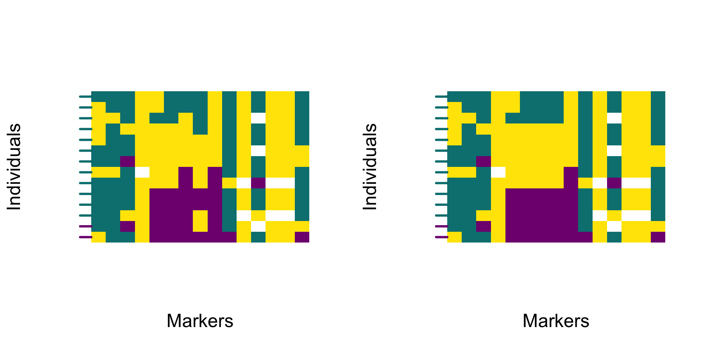

# Smoothing polarised genotypes


After filtering markers by diagnostic index (Chapter \@ref(DIfiltering)), genome polarisation analyses can be mapped to physical coordinates to reveal the genomic landscape of barriers to gene flow. Because SNVs are rarely evenly spaced along chromosomes, the polarised signal can fluctuate sharply between adjacent markers. But these fluctuations might not represent signal change, but confluence with standing genetic variation. While, diagnostic index filtering already removed much of the effect of genetic variation orthogonal to the barrier to gene flow, smoothing along mapped distances helps visualise broad ancestry patterns.


## Smoothing across mapped distances

The `smoothPolarizedGenotypes` function applies kernel smoothing to the polarised genotype matrix, using physical distances between markers rather than their rank order. This approach preserves the broad genomic signal while suppressing local irregularities caused by uneven SNV spacing.

### Mapping diagnostic markers

The chromosomal coordinates of diagnostic markers are stored in the output file *-includedSites.txt*, created during VCF conversion by the function `vcf2diem`. This file lists all sites retained for polarisation and includes columns CHROM, POS, QUAL from the VCF file and allele0 and allele2 indicating alleles represented by the respective numbers when homozygous.

The positional information needed for smoothing can be extracted directly from this file. The function `rank2map` converts the ranked order of sites in the polarised genotype matrix into their corresponding chromosomal coordinates based on the *-includedSites.txt file. While it is called internally by `smoothPolarizedGenotypes`, exploring its output helps understand how physical mapping guides the smoothing process.


<details><summary>Full code to prepare data to execute the examples in this chapter</summary>
```{r, eval=FALSE}
library(diemr)

dat <- system.file("extdata", "myotis.vcf", package = "diemr")

vcf2diem(SNP = dat, filename = "myo", requireHomozygous = FALSE)

set.seed(54869)
res <- diem("myo-001.txt", ChosenInds = 1:14)

gen <- importPolarized("myo-001.txt", 
  changePolarity = res$markerPolarity, 
  ChosenInds = 1:14  
)

HI <- hybridIndex(gen)
```
</details>

```{r rank2map-chunk, eval = FALSE}
# read the includedSites file
bed <- readIncludedSites("myo-includedSites.txt")

# generate mapping of ranks to genome positions
windows <- rank2map("myo-includedSites.txt", windowSize = 150)

# show how window ranges correspond to sites
cbind(windows, bed)
#     1  2      CHROM POS QUAL allele0 allele2
# 1   1  1 KE210828.1  60    .       A       G
# 2   2  2 KE210828.1 171    .       G       T
# 3   3  3 KE212673.1  84    .       A       T
# 4   4  4 KE214857.1  90    .       A       G
# 5   5  8 KE222443.1 134    .       G       A
# 6   5  8 KE222443.1 156    .       T       G
# 7   5  9 KE222443.1 171    .       T       G
# 8   5  9 KE222443.1 183    .       C       T
# 9   7  9 KE222443.1 244    .       C       G
# 10 10 10 KE222801.1 100    .       G       A
# 11 11 14 KE224361.1 120    .       G       A
# 12 11 14 KE224361.1 132    .       G       C
# 13 11 14 KE224361.1 175    .       A       C
# 14 11 14 KE224361.1 179    .       G       T
# 15 15 15 KE227386.1 153    .       A       G
```

Each entry in `windows` corresponds to one marker in the *myo-includedSites.txt* file and shows a range of sites that are within the desired `windowSize`, where the window is centered at the reference site. In practice, `rank2map` looks for half the `windowSize` in either direction from the evaluated site, respecting the afinity to unique `CHROM` values. For genomes composed of multiple scaffolds or chromosomes, smoothing should be performed separately for each element, and `rank2map` ensures that the windows are set up with respect to `CHROM` values.

### Visual comparison of raw and smoothed results

For smoothing to work, the sites in the original vcf file must be sorted. 

```{r, eval = FALSE}
# smooth the polarised genotypes using a 150 bp window
genSmooth <- smoothPolarizedGenotypes(genotypes = gen,
	includedSites = "myo-includedSites.txt",
	windowSize = 150)
```

The object returned by `smoothPolarizedGenotypes` is a genotype matrix with the same dimensions and site order as the input but containing smoothed genomic state values. These can be used interchangeably with raw genotypes in visualisation and hybrid index calculations.

The smoothing window is expressed in base pairs, should correspond to the expected local scale of linkage. As recombination rates differ among taxa, selecting an appropriate window is best guided by empirical inspection. Compare several values to find the level of smoothing that preserves broad ancestry patterns without obscuring fine-scale transitions.
Larger windows produce a more continuous signal but can merge distinct ancestry blocks, while smaller windows follow local fluctuations more closely. The optimal setting depends on marker density and linkage along the genome.

::: {.box .caution}
Smoothing is recommended only for mapped data. Applying it to unordered or scaffold-level data can distort the genomic signal.
:::

Smoothing does not change the overall polarity of sites but modifies their local continuity. The following example compares raw and smoothed genotypes.

```{r, eval = FALSE}
par(mfrow = c(1, 2))
plotPolarized(gen, HI)
plotPolarized(genSmooth, HI)
```

```{r, echo = FALSE, eval = TRUE, out.width = '100%'}

```

The smoothed profile follows the same overall trajectory as the raw data but removes short-range noise caused by individual SNVs. The resulting heatmap highlights broad transitions in ancestry and provides a clearer estimate of barrier to gene flow along chromosomes.


## Interpretation and downstream use

Smoothing algorithm implemented in `diemr` since version 1.4.2 uses a truncated Laplace kernel to calculate weighted mode genomic state for each smoothed site. The Laplace kernel gives the highest weight to nearby markers while gradually down-weighting distant ones, producing smooth but localised transitions in the polarised signal. The truncation limits the influence of distant loci so that ancestry shifts remain aligned with finite physical genomic distance.


Mapping and smoothing improve interpretability of *diem* output in three ways:

1. stabilising local genomic states and reducing noise caused by marker spacing,

2. expressing barrier strength and ancestry transitions in physical coordinates, and

3. facilitating integration with genomic context such as recombination rate, gene density, or structural features.

When reporting smoothed results, always specify the window size and kernel type used.
Smoothing clarifies broad-scale patterns but should not replace marker-level interpretation.


<details><summary>**Methodological explanation of the Laplace kernel smoothing**</summary>
### Methodological explanation of the Laplace kernel smoothing

The smoothing algorithm applies a truncated Laplace kernel over physical distance and assigns each site the weighted modal genomic state within the window. This can be described as **Laplace-kernel weighted mode smoothing**.

Smoothing is applied **per chromosome**. For each individual \(i\) and focal site \(j\) at position \(x_j\), we consider all neighbouring sites within a symmetric window of half-width \(\text{windowSize}/2\) base pairs. Rather than averaging genotype values, the algorithm computes a **kernel-weighted vote** over discrete genomic states \(s \in {0,1,2}\) (homozygous genotypes of two most frequent alleles denoted as `0` and `2`, and heterozygots as `1`, chapter \@ref(diemFormat)) and assigns the **state with the highest weighted support** to the focal site.

The goal is to reduce short-range noise caused by uneven marker spacing and stochastic variation, while preserving discrete genomic states that reflect linkage blocks and recombination.

The smoothing method considers a **centred physical window** of width `windowSize` (bp), i.e. positions \(x\) with
\[
x \in \left[x_j - \frac{\text{windowSize}}{2}, x_j + \frac{\text{windowSize}}{2}\right].
\]
Within that window, neighbouring markers "vote" for their discrete genomic states \(s\in{0,1,2}\) with **Laplace weights** that decay with distance from the focal site. The smoothed value at \(j\) is the **weighted mode** (state with the largest total weight).


It is important that the smoothing is applied to physical distances between SNVs, so the `rank2map` internally computes the **start and end site indices** whose positions fall inside the centred interval for site \(j\).

#### Implemented kernel, truncation and scaling

Let \(d = x - x_j\) be the **centred physical distance** (bp) from the focal site. The kernel is only ever evaluated inside the centred window; weights for positions outside are never computed or used.

Define the **Laplace scale** \(b\) as a function of `windowSize`:
\[
b = \frac{\text{windowSize}}{2 \ln 20}.
\]

This choice guarantees that a two-sided Laplace distribution truncated at \(\pm b\ln 20\) retains 95% of its mass (because \(\Pr(|X|>a)=e^{-a/b}\), so with \(a=b\ln 20\), the tail is \(1/20=0.05)\).

The code evaluates integer-spaced centred offsets
\[
x \in {-\lfloor \tfrac{\text{windowSize}}{2}\rfloor,\ldots, -1,0,1,\ldots,\lfloor \tfrac{\text{windowSize}}{2}\rfloor}
\]
and assigns **truncated Laplace weights**:
\[
w_x = \frac{10}{19} \exp\left(-\frac{|x|}{b}\right),\quad \text{for } |x| \le \frac{\text{windowSize}}{2}.
\]


> **Notes on scaling and normalisation:**
> 
>* The constant \(10/19\) is an explicit global scaling applied to all in-window weights (see `truncatedLaplace`); it is not a per-site normalisation.
>* Because the algorithm selects a **weighted mode**, only relative weights matter; any common multiplicative constant cancels.
>* There is no per-window re-normalisation; the code compares **sums of weights** across states directly.


#### Weighted-mode smoothing

For each focal site \(j\) and individual \(i\), we compute **state-specific support** by summing weights over all neighbours within the centred window whose genotype equals that state:
\[
S_s(i,j) = \sum_{k \in \text{window}(j)}
  \begin{cases}
    w_{(x_k - x_j)}, & \text{if } g_{i,k} = s, \\
    0, & \text{otherwise.}
  \end{cases}
\]

The **smoothed state** is the argmax:
\[
\tilde g_{i,j} = \arg\max_{s\in{0,1,2}} S_s(i,j),
\]
ignoring `NA` genotypes in the sums.


#### Tie-breaking (exact order used)

If two or more states tie, internal function `unbiasedWeightedStateChoice` breaks ties in this strict sequence:

1. **Higher total weight** \(S_s(i,j)\) (the primary criterion).
2. **Higher single-occurrence weight** for the state (i.e. the largest \(w\) among markers supporting that state).
3. **Lexicographic order** of the state label (with numeric states treated as character, effectively `"0" < "1" < "2"`).

This is the complete list; there is **no** preference for the focal site's own genotype unless it wins under the rules above.

</details>


