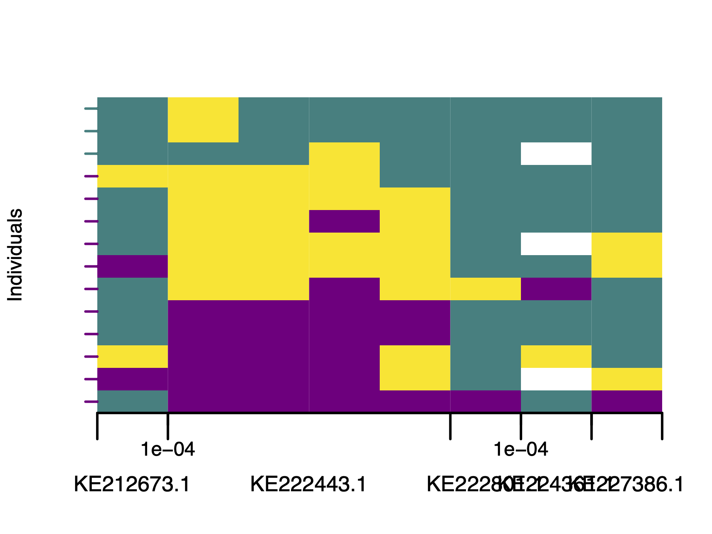
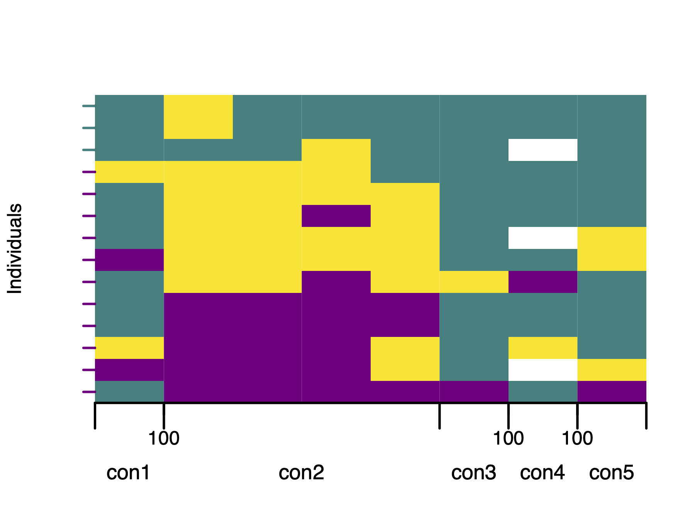

# Visualisation of polarised genotypes


Visualisation is a key step in interpreting the results of genome polarisation.
The `diemr` package provides several functions for graphical inspection of polarised genotypes, including `plotPolarized` for genome-wide patterns, `plotMarkerAxis` for adding chromosome information, and `plotDeFinetti` for individual genotype composition summaries.

## Plotting polarised genotypes

The function `plotPolarized` displays genotypes in either a rectangular or a circular (iris-style) layout.
Rows represent individuals and columns represent single-nucleotide variants (SNVs).
Colours correspond to genotype states: by default, purple and green mark the two homozygote classes (`0` and `2`), yellow marks heterozygotes (`1`), and white indicates missing data (`_`).

The polarised genotypes must first be imported with correct site polarity. The polarity will be in memory in element `res$markerPolarity` described in (Chapter \@ref(intro)) or in the obligatory output file _MarkerDiagnosticsWithOptimalPolarities.txt_ (Chapter \@ref(markerDiagnostics)) in the column `newPolarity`.


``` r
# Import polarised genotypes
gen <- importPolarized(
  file = system.file("extdata", "data7x10.txt", package = "diemr"),
  changePolarity = c(TRUE, FALSE, TRUE, TRUE, FALSE, FALSE, TRUE, FALSE, FALSE, TRUE),
  ChosenInds = 1:7
)

# Calculate individual hybrid indices from the imported genotypes 
HI <- hybridIndex(gen)
```


### Rectangular plot

The rectangular layout is useful for viewing the order of markers along the genome and for comparing individual hybrid indices along the vertical axis. This is the default plot, and uses the matrix of polarised genotypes and the numeric vector of individual hybrid indices.


``` r
plotPolarized(genotypes = gen, HI = HI, useRaster = FALSE)
```


Each individual is plotted in order of increasing hybrid index, from bottom to top.
A colour transition across the plot reveals the genomic gradient between parental sides.

#### Adding chromosome information {#plotMarkerAxis}

If the input data were generated from a VCF file, marker positions are already available.
The file `*-includedSites.txt` produced by `vcf2diem` stores physical coordinates for each marker and can be used to draw chromosome names and position ticks beneath the genotype matrix. This file links plotted markers to their genomic locations.

The following example uses a snippet of SNV data with _Myotis_ bat diversity [@Harazim2021].


``` r
# Prepare input data
myo <- system.file("extdata", "myotis.vcf", package = "diemr")
vcf2diem(SNP = myo, filename = "myo")
inds <- 1:14


# Polarise genotypes assuming diploid data
res <- diem("myo-001.txt", ChosenInds = inds, ploidy = FALSE)

# Import polarised genotypes
gen <- importPolarized("myo-001.txt", 
	changePolarity = res$markerPolarity, 
	ChosenInds = inds)
	
# Calculate hybrid indices	
HI <- hybridIndex(gen)

# Plot polarised genotypes with the marker axis 
plotPolarized(
  genotypes = gen,
  HI = HI,
  addMarkerAxis = TRUE,
  includedSites = "myo-includedSites.txt",
  tickDist = 100
)
```




If the default marker axis needs adjustments, such as here, where accession numbers overlap, use `plotMarkerAxis` directly. This returns an `axisInfo` list so you can modify labels before redrawing. `plotMarkerAxis` also accepts additional graphical arguments.


``` r
# Draw plot without axis
plotPolarized(
  genotypes = gen,
  HI = HI,
  addMarkerAxis = FALSE,
  xlab = ""
)

# Draw marker axis, and capture axis information
axisInfo <- plotMarkerAxis(includedSites = "myo-includedSites.txt", tickDist = 100)
```

The `axisInfo` list will now contain five elements with plotting data. Let's shorten the contig names and convert the tick labels to base pairs (default is to display milions of base pairs). This list can then be used for plotting directly, without the need to recalculate the position of the axis elements from the `*-includedSites.txt` file.


``` r
print(axisInfo)
# $CHROMbreaks
# [1] 0.5 1.5 5.5 6.5 7.5 8.5
# 
# $CHROMnamesPos
# [1] 1.0 3.5 6.0 7.0 8.0
# 
# $CHROMnames
# [1] "KE212673.1" "KE222443.1" "KE222801.1" "KE224361.1" "KE227386.1"
# 
# $ticksPos
# [1] 1.5 6.5 7.5
# 
# $ticksNames
# [1] 1e-04 1e-04 1e-04

# Update list elements
axisInfo$CHROMnames <- c("con1", "con2", "con3", "con4", "con5")
axisInfo$ticksNames <- c(100, 100, 100)

# Plot polarised genotypes with updated marker axis labels
plotPolarized(
  genotypes = gen,
  HI = HI,
  addMarkerAxis = FALSE,
  xlab = ""
)
plotMarkerAxis(axisInfo = axisInfo)
```




## Circular (iris) plot

The circular layout displays the same information radially, emphasising the continuity of ancestry along chromosomes. Individuals are ordered from the centre (lowest hybrid index) to the periphery (highest).


``` r
plotPolarized(genotypes = gen, HI = HI, type = "circular")
plotMarkerAxis(axisInfo = axisInfo, 
  labels.facing = "in", 
  major.tick.length = 1
)
```

<!-- -->

The marker axis in circular plots is drawn analogically to rectangular plots (Chapter \@ref(plotMarkerAxis)), but chromosome names and tick marks are shown as separate elements. Chromosome names appear in an inner track with alternating white and grey shading, while tick marks showing distances along each chromosome are plotted on the outer rim of the genotype rings.


This layout is compact for displaying genomes of many individuals and highlights symmetry or asymmetry between parental contributions. However, circular plotting of large datasets (more than \(10^5\) markers) can be slow. To monitor progress, set `showProgress = TRUE` in `plotPolarized`. This prints the percentage of plotted individuals to the standard output during rendering.


