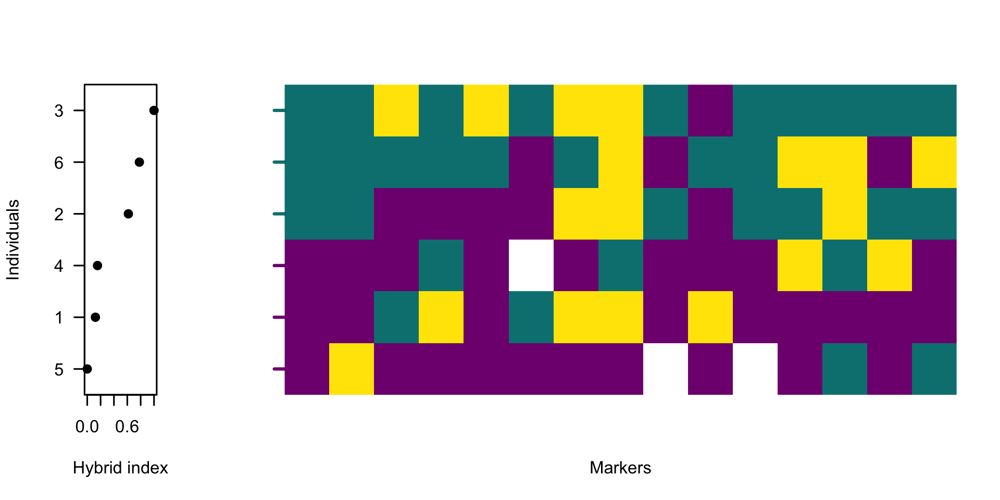
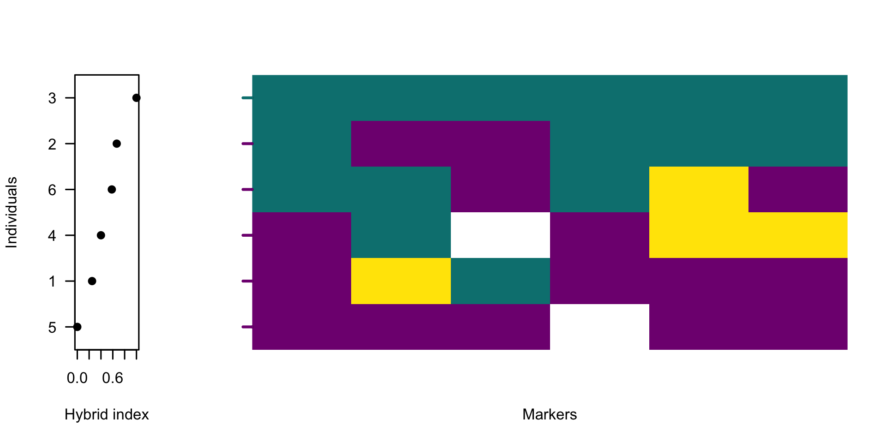
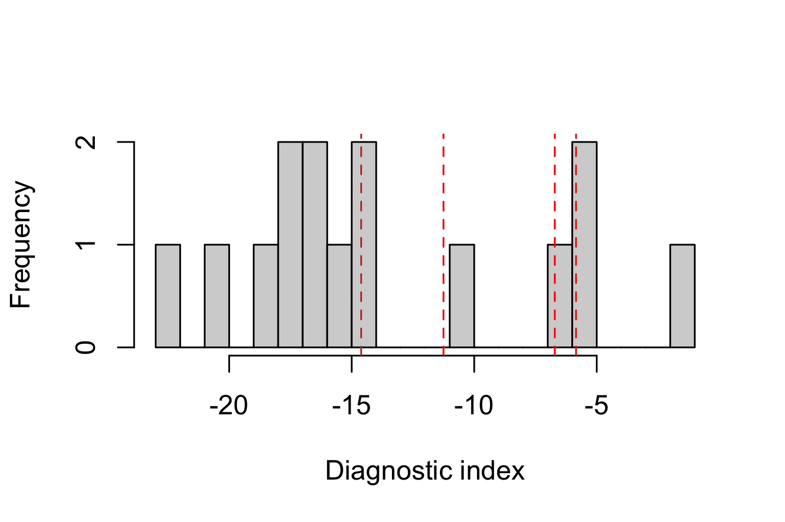
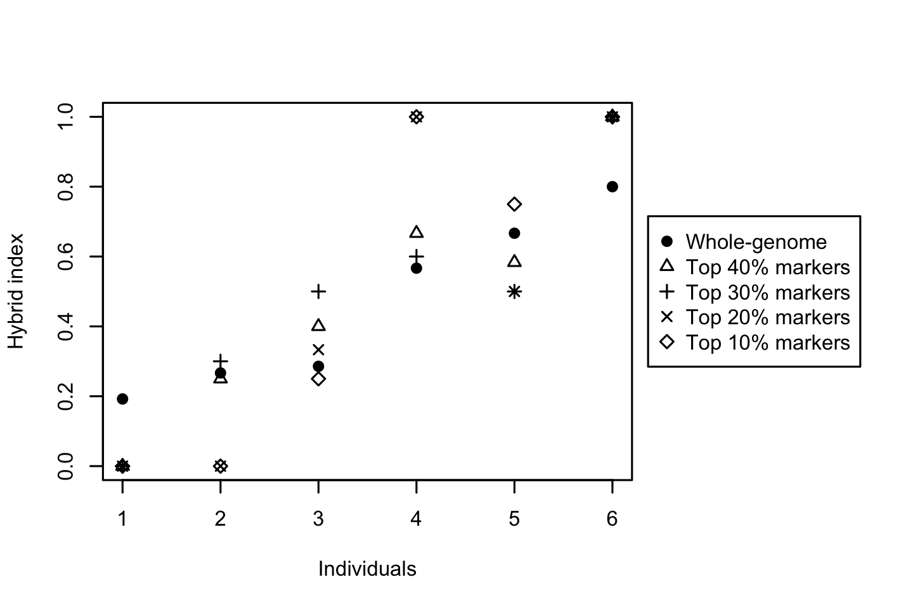

# Filtering sites by diagnostic index {#DIfiltering}


After obtaining polarised genotypes and diagnostic indices from previous steps, the next step is to identify markers that most clearly distinguish the two sides of the barrier. This chapter demonstrates how to use the diagnostic index for that purpose. A note in the Chapter \@ref(intro) cautioned against using whole-genome summaries for downstream analyses. This chapter expands the *Quick start* introduction.

During genome polarisation, each site receives a likelihood-based **diagnostic index (DI)** that quantifies its contribution to distinguishing the two sides of the barrier. Sites with low DI are weakly informative and act as noise; they inflate apparent heterogeneity and reduce clarity in hybrid index (HI) plots. Filtering sites by DI allows extraction of informative genomic markers that:

* reduce noise from standing genetic variation,
* produce steeper clines in HI profiles,
* enhance contrast between groups in genotype heatmaps,
* stabilise window‑based summaries.

However, filtering is a trade‑off. Retaining too few sites can oversimplify the genomic pattern, while keeping all markers may obscure structure within background noise. No universal DI threshold exists; the optimal cutoff depends on genetic variation within the dataset and the divergence captured by the barrier to gene flow. Therefore, inspect the results visually to decide.


The DI values are exported for all sites, and are either available in the standard output from `diem` in an element `DI` in column `DI` or in the output file *MarkerDiagnosticsWithOptimalPolarities.txt* (Chapter \@ref(markerDiagnostics)). This example will demonstrate DI-filtering from the file. Let's first display polarised genotypes without filtering sites by their diagnostic index.


<details><summary>Full code to prepare data to execute the examples in this chapter</summary>

``` r
library(diemr)

dat <- system.file("extdata", "testBarrier2.txt", package = "diemr")
inds <- 1:6

res <- diem(files = dat, ChosenInds = inds)
```
</details>


``` r
# read the marker diagnostics file. read.table is possible, 
# but for large genomic datasets, fread from the pacckage
# data.table is more efficient
DI <- data.table::fread("MarkerDiagnosticsWithOptimalPolarities.txt", 
  header = TRUE, data.table = FALSE
)

# import polarised genotypes for the diagnostic markers
gen <- importPolarized(
  system.file("extdata", "testBarrier2.txt", package = "diemr"),
  changePolarity = DI$newPolarity,
  ChosenInds = 1:6,
  ChosenSites = "all"
)

# calculate hybrid indices from the filtered genotypes
HI <- hybridIndex(gen, rescale = TRUE)

# plot HI and all genotypes
layout(matrix(c(1,2,2,2,2), nrow = 1))
indOrder <- order(HI)
# plot hybrid indices
plot(HI[indOrder], 1:length(HI), 
  xlab = "Hybrid index", ylab = "Individuals", axes = FALSE,
  ylim = c(0.5, length(HI) + 0.5), pch = 19,
  yaxs = "i", xpd = NA)
# add axes with ordered individual labels
axis(1)
axis(2, at = 1:length(HI), labels = inds[indOrder], las = 1)
box()
# plot genotypes
plotPolarized(gen, HI = HI, ylab = "")
```



The function `hybridIndex` estimates the proportion of alleles belonging to one side of the barrier across all polarised sites for each individual, automatically accounting for missing data. `plotPolarized` orders individuals by their hybrid index. Displaying the hybrid indices alongside a heatmap of polarised genotypes provides a visual guide to the quantitative change in genome admixture. 

The figure shows high genetic variability across the data. Next, let's plot only 40% of markers with the highest diagnostic index. 


``` r
# keep the top 40% most diagnostic sites
threshold <- 0.6
whichMarkers <- DI$DI >= quantile(DI$DI, probs = threshold)

# calculate hybrid indices from the filtered genotypes
HI2 <- hybridIndex(gen[, whichMarkers], rescale = TRUE)

# plot HI and all genotypes
layout(matrix(c(1,2,2,2,2), nrow = 1))
indOrder2 <- order(HI2)
# plot hybrid indices
plot(HI2[indOrder2], 1:length(HI2), 
  xlab = "Hybrid index", ylab = "Individuals", axes = FALSE,
  ylim = c(0.5, length(HI) + 0.5), pch = 19,
  yaxs = "i", xpd = NA)
# add axes with ordered individual labels
axis(1)
axis(2, at = 1:length(HI2), labels = inds[indOrder2], las = 1)
box()
# plot genotypes
plotPolarized(gen[, whichMarkers], HI = HI2, ylab = "")
```




## Selecting the filtering threshold

With the hybrid index being a proportion of alleles belonging to one side of barrier to gene flow, typical outcome of filtering SNVs by DI is a set of informative markers that shows **tighter clustering** of individuals near 0 and 1, and a steeper, interpretable gradient across hybrids. However, emphasizing the genomic differences by selecting markers that approach being homozygous on one side of the barrier can have an undesirable effect of highlighting the influence of outliers. These might be inbred individuals, samples with low sequencing coverage or mapping quality or divergent samples informing of a biologically-relevant mechanism. Such individuals are rarely the target of admixture studies, yet they can disproportionately influence the *diem* algorithm and appear as spurious barriers in heavily filtered datasets. To avoid this, the user has two options. 

1. To remove the outlier individuals from the analyses using the `ChosenInds` argument.
2. To find the DI filtering threshold that displays the desired barrier to gene flow before it becomes overloaded with outlier pull.

The first option is the cleanest, but both are not mutually exclusive. Let's use the previous example to explore a range of threshold values and their effect on the barrier to gene flow.


``` r
thresholds <- c(0.6, 0.7, 0.8, 0.9)

# inspect distribution of DI values
hist(DI$DI, xlab = "Diagnostic index", n = 20, main = "")
abline(v = quantile(DI$DI, probs = thresholds), col = "red", lty = 2)
```





Plotting the DI distribution helps identify whether the dataset has a natural break or continuous spectrum of diagnostic values, guiding selection of a reasonable cutoff. Often in genomic datasets, the distribution of DI values is unimodal. In such cases, exploring how DI filtering affects hybrid index profiles is a more informative way to select an appropriate threshold.


``` r
# load HI from the ploidy-aware whole-genome HI in diem output
HI <- hybridIndex("HIwithOptimalPolarities.txt", rescale = FALSE)
indOrder <- order(HI)

layout(matrix(c(1,1,1,2), nrow = 1))
plot(HI[indOrder], pch = 19, ylim = c(0, 1), axes = FALSE,
    xlab = "Individuals", ylab = "Hybrid index"
)
axis(2, las = 1)
axis(1, at = 1:length(HI), labels = indOrder)
box()

for (threshold in thresholds){
  whichMarkers <- DI$DI >= quantile(DI$DI, probs = threshold)
  HI <- hybridIndex(gen[, whichMarkers], rescale = FALSE)
  points(1:length(HI), HI[indOrder], pch = threshold * 10 - 4) 
}
# legend for the comparison of DI thresholds
plot.new()
legend("right", xpd = NA, 
  legend = c("Whole-genome", paste0("Top ", 100 * (1 - thresholds), "% markers")),
  pch = c(19, thresholds * 10 - 4)
)
```



Based on these plots, the barrier to gene flow progressively increases. Note that the order of individuals was taken from *the HIwithOptimalPolarities.txt* file produced by the  `diem` run. These values are based on whole-genome variability taking into account compartment ploidy as it was defined during the analysis. This is the preferred way to explore the influence of alternative threshold values, because the visualisation is also sensitive to how individuals might change positions along the HI slope.

::: {.box .caution}
**Caution:** Because DI depends on allele frequency differences, sample size, and the polarities of all assessed sites, DI values are not directly comparable across independent runs, species pairs, or datasets. Derive cutoff thresholds (for example, top quantiles) within each dataset, and report the number or proportion of retained markers.
:::


## Biological signal insights

Filtering by DI is not mandatory, but it is an efficient way to reveal the core signal of genome polarisation. Patterns that were previously noisy or ambiguous often become clear once low‑information markers are excluded. When reporting results, state your DI quantile cutoff and confirm that qualitative interpretations remain robust across reasonable thresholds.

Diagnostic markers often occur in genomic regions under strong differentiation or selection that maintain alternative alleles between taxa, whereas sites with low diagnostic index are typically typically reflect shared or neutral polymorphisms. Thus, filtering sites by diagnostic index not only increases contrast but also enriches for genomic regions that maintain species boundaries.

Because markers with high DI are not evenly distributed along chromosomes [@Jagos2025], DI filtering can shift the apparent contribution of different genomic regions to the overall signal. Regions with many fixed differences will remain densely represented, while more homogeneous or highly variable regions may contribute fewer diagnostic markers. When summarising results in windows or genomic compartments, keep this unequal site density in mind. 

