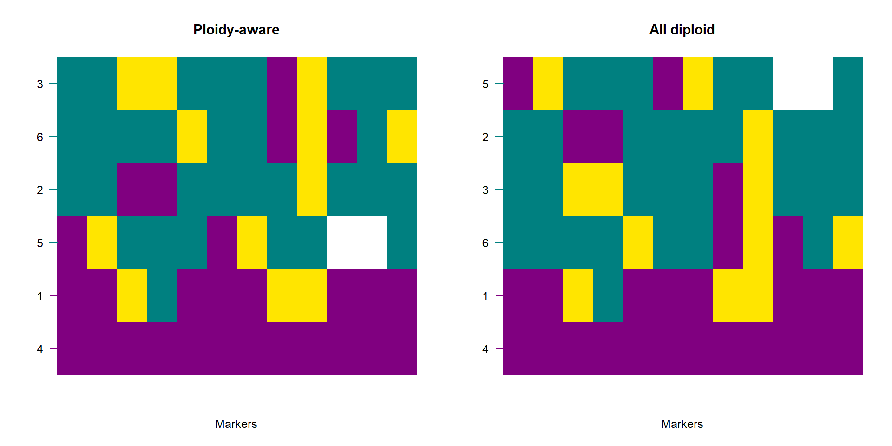

# Ploidy-aware genome polarisation {#ploidy2}


Genome polarisation with the *diem* algorithm was developed for biallelic genomic sites, where each site contributes one of four possible states: an undetermined genomic state or missing data, homozygous for one allele, heterozygous, or homozygous for the alternative allele. Many biological datasets, however, contain genomic **regions of different ploidy** within the same individual. These include sex chromosomes, pseudo-autosomal regions, organellar genomes, and other genomic regions with reduced or increased ploidy.

The *diem* model of diagnostics assumes that the information contributed by a site scales with the number of allele copies sampled per individual [@Baird2023]. Genomic compartments that are haploid or hemizygous therefore contribute less information per site than diploid regions. Treating all sites as diploid can bias likelihood estimates and hybrid index calculations unless ploidy differences are explicitly accounted for, particularly in cases where diagnostic markers accumulate in non-diploid genomic regions.

This chapter describes how `diemr` handles ploidy-aware genome polarisation and how hybrid indices can be calculated consistently across compartments of different ploidy.


## Mapping compartments and their ploidy

A *compartment* is a subset of sites for which we can specify ploidy for each of the analysed individuals. For example:

* autosomes: ploidy = 2 for all individuals,
* X chromosome: ploidy = 2 for XX, 1 for XY,
* mitochondria: ploidy = 1,
* Y chromosome: ploidy = 0 or 1 depending on sex.

We use the term *compartment* rather than *chromosome* because compartments are defined by ploidy regime, not by chromosomal identity. Moreover, when using parallel processing in *diem*, the grain of parallelisation is a compartment. Parallelisation is more efficient (less overhead) if compartments have similar sizes, which is unlikely when each compartment corresponds to a chromosome.

The *diem* algorithm estimates an optimal polarity for each site. Individual ploidy enters through the compartment definition, which specifies how many allele copies are expected per individual for the sites in that compartment and therefore how sites contribute to the likelihood and to the hybrid index.

Compartment ploidy is a required argument in *diem* analysis, and site polarities are inferred from the model that is ploidy-aware. The compartment and ploidy mapping is introduced with a worked example in Chapter \@ref(ploidy). 


<details><summary>Full code to prepare data to execute the examples in this chapter</summary>

``` r
library(diemr)

filepaths <- c(system.file("extdata", "testBarrier.txt", package = "diemr"),
               system.file("extdata", "testBarrier2.txt", package = "diemr"))
               
ploidies <- list(rep(2, 6),
                 c(2, 1, 2, 2, 1, 1))

samples <- 1:6

CheckDiemFormat(files = filepaths, 
                ChosenInds = samples,
                ploidy = ploidies,
                quiet = TRUE)
# File check passed: TRUE
# Ploidy check passed: TRUE

# Set random seed for reproducibility
set.seed(39583782)

# Run diem 
res <- diem(files = filepaths, 
            ploidy = ploidies, 
            markerPolarity = FALSE,
            ChosenInds = samples, 
            nCores = 1)

# Import polarised genotypes
gen <- importPolarized(file = filepaths, 
                       changePolarity = res$markerPolarity, 
                       ChosenInds = samples) 
```
</details>


## Hybrid index under varying ploidy

In *diem*, the hybrid index is derived from genomic state summaries. For each individual, polarised genotypes are first summarised into counts of the four genomic states (undetermined, 0, 1, 2), forming a \({}^4\mathbf{I}\) genomic state count vector. Hybrid indices are then calculated from the \({}^4\mathbf{I}\) genomic state summaries, and not directly from per-site genotypes.

When sites are partitioned into compartments with different ploidy, genomic state counts are first computed separately for each compartment. These compartment-wise \({}^4\mathbf{I}\) summaries are then converted to allele count summaries by multiplying each individual's compartment counts by the corresponding compartment ploidy. The resulting \({}^4\mathbf{A}\) allele count matrices are summed across compartments to obtain a single ploidy-aware genomic state summary per individual.

The hybrid index for an individual is calculated from this combined \({}^4\mathbf{A}\) summary as the proportion of alternative alleles among all called alleles, excluding undetermined states. This procedure ensures that compartments with lower ploidy contribute proportionally fewer allele copies.

This construction allows hybrid index values to be compared consistently within datasets that contain genomic regions of different ploidy.


## Implementation

From `diemr 1.5.2`, the function `hybridIndex` automatically performs ploidy-aware calculations when paths to input data in `diem` format, a vector of polarities for all sites, and a list with ploidy vectors for all individuals and all compartments are provided. This gives identical result to hybrid indices in the output file *HIwithOptimalPolarities.txt*. Hybrid indices calculated without supplying compartment ploidy are implicitly treated as diploid and will generally differ.


``` r
# Hybrid indices from diem run
HI1 <- hybridIndex("HIwithOptimalPolarities.txt")

# Calculated ploidy-aware hybrid indices
HI2 <- hybridIndex(x = filepaths, ploidy = ploidies, 
   changePolarity = res$markerPolarity)

# Calculated hybrid indices without considering ploidy
HI3 <- hybridIndex(gen)

all.equal(HI1, HI2)
# [1] TRUE

all.equal(HI2, HI3)
# [1] "Mean relative difference: 0.01367976"
```

Adjusting the hybrid indices according to compartment ploidies is especially important when filtering for diagnostic markers (Chapter \@ref(DIfiltering)) results in compartments with different ploidies including many diagnostic markers. 


``` r
# Select top 40% of the most diagnostic markers
whichMarkers <- res$DI$DI >= quantile(res$DI$DI, prob = 0.6)

hi2 <- hybridIndex(x = filepaths, ploidy = ploidies, 
   changePolarity = res$markerPolarity, 
   ChosenSites = whichMarkers)

hi3 <- HI3 <- hybridIndex(gen, ChosenSites = whichMarkers)

# plot with ploidy-aware hybrid indices and without ploidy information
par(mfrow = c(1, 2))
plotPolarized(gen[, whichMarkers], HI = hi2, labels = samples, main = "Ploidy-aware")
plotPolarized(gen[, whichMarkers], HI = hi3, labels = samples, main = "All diploid")
```



## Interpretation considerations

Ploidy-aware hybrid indices behave identically to diploid indices when comparing individuals within a dataset—values remain constrained to \([0,1]\) and reflect the proportion of ancestry belonging to the chosen side of the barrier. However, when regions vary strongly in ploidy (e.g., autosomes vs X vs Y):

* haploid regions produce allele proportions with lower sampling variance per site,
* compartments with many sites dominate the genome-wide mean,
* the influence of mitochondria or sex chromosomes depends strictly on their diagnostic marker count, not their biological magnitude.

When comparing datasets with different compartment definitions or different numbers of markers per compartment, interpretation must therefore focus on **within-dataset structure**, not absolute values across analyses.

